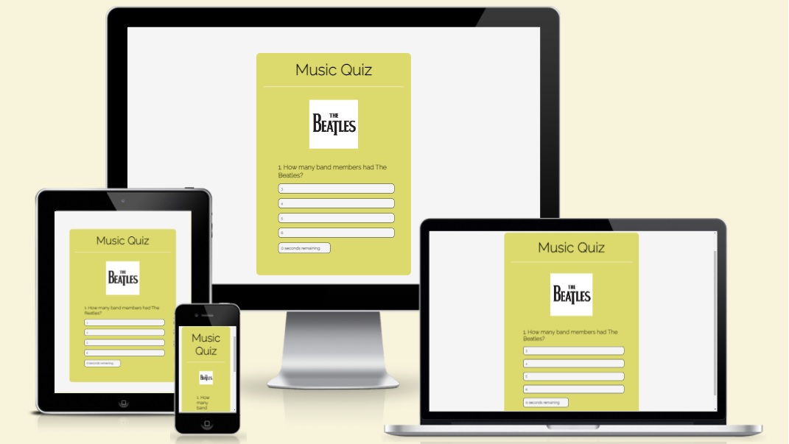
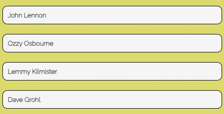
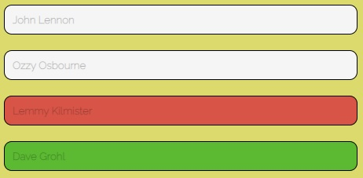
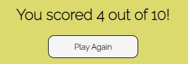
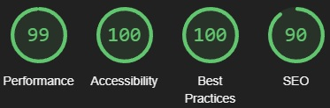

# Music Quiz
This is a quiz made with JavaScript and some basic HTML and CSS. 

It is meant to test your knowledge by answering some questions, showing images and doing it under time pressure.

Do you want to test your friends or compete against them? Then this quiz is for you, it's easy to use, simple and responsive for (all) devices.

# Features
There's a couple of features on this site, check them out here!

## Existing Features
* Music Quiz header
  - This header is presented throughout the whole quiz.

* Question image
  - Here's an image that relates to the question, every question will have its own image that's related to the question.

* Question area
  - The user will be presented by a question every time they click the Next button.

* Answer area
  - Here the user will be able to choose ONE answer out of a fixed amount of answers.
  - If they choose the incorrect answer, it will turn RED, and the correct answer will turn GREEN.
  - If they choose the correct answer, it will turn GREEN.

* Timer
  - The user will have 30 seconds to choose an answer.
  - The timer will reset for every question.

* The Next question button
  - Whenever the user choose an answer, the "Next" button will appear.

* The users score out of 10
  - After 10 questions, the user will get their score and the possibility to click "Play Again" to start the quiz from the beginning.

## Features left to implement
* No points to the user if the timer runs out.

* The possibility to enter a username and implement a leaderboard.

# Testing
* Testing through Lighthouse in devTools:

* The site is designed to be fully functional on apple products through the test on (https://ui.dev/amiresponsive).

## Validator Testing
* HTML:
  - No errors were returned when passing through the official [W3C validator](https://validator.w3.org/).

* CSS:
  - No errors were returned when passing through the official [(Jigsaw) validator](https://jigsaw.w3.org/css-validator/).

* JavaScript:
  - No errors were found when passing through the official [Jshint validator](https://jshint.com/).
    - The following metrics were returned:
    - There are 13 functions in this file.
    - Function with the largest signature take 1 arguments, while the median is 0.
    - Largest function has 8 statements in it, while the median is 4.
    - The most complex function has a cyclomatic complexity value of 2 while the median is 2.

* No bugs were found.

# Deployment
* The site is deployed on GitHub pages. Here are the steps to deploy:
  - In the GitHub repository, navigate to the Settings tab.
  - In the Settings tab, navigate to the Pages tab.
  - In the Pages tab, navigate to the Branch and use the drop-down menu to choose Main branch.
  - Press Save, and the site is now deployed to GitHub.

The live link to this site can be found here: https://mysanthropium.github.io/project2/

### Credits
* Content
  - The fonts used for this page was taken from Google Fonts.
  - The images for this page was taken from Google.
  - I had help of a tutor to make my Timer work properly.
  - The quiz was built with the help of a youtube tutorial - https://www.youtube.com/watch?v=PBcqGxrr9g8

